

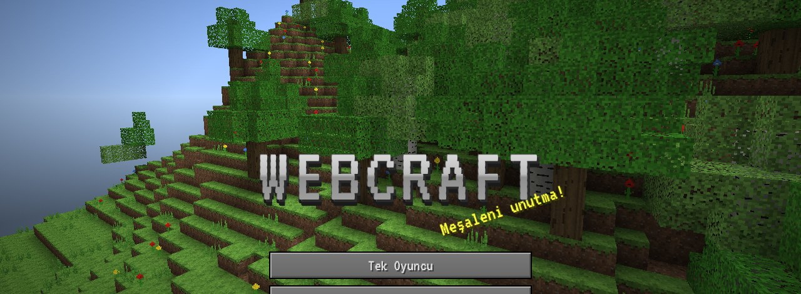

# ⛏️ WebCraft

**Tarayıcıda çalışan, sıfırdan yazılmış açık dünya blok oyunu.**
Kurulum yok, kütüphane yok, derleme yok. `index.html` dosyasını aç ve kazmaya başla.

[Özellikler](#-özellikler) · [Ekran görüntüleri](#-ekran-görüntüleri) · [Nasıl oynanır](#-nasıl-oynanır) · [Kontroller](#-kontroller) · [Kod yapısı](#-kod-yapısı) · [Lisans](#-lisans)

---

## 🧱 Bir bakışta

| | |
| --- | --- |
| 🌍 **Sonsuz dünya** | Tohumla üretilen kıtalar, dağlar, nehirler, mağaralar ve 9 biyom |
| 🔥 **Üç boyut** | Yerüstü, Cehennem ve Boşluk Ejderhası'nın beklediği Boşluk Diyarı |
| 🏘️ **Köyler** | 8 meslekten köylü ve zümrütle ticaret |
| ✨ **Büyü ve örs** | Tecrübe seviyesi, büyü masası, büyülü kitaplar |
| ⚡ **Şimşektaş devreleri** | Toz, meşale, yineleyici, piston, lamba, kapılar ve TNT |
| 🔊 **Gerçek sesler** | Açık lisanslı kayıtlar sayfaya gömülü, internetsiz de çalar |
| 📱 **Her cihazda** | Bilgisayarda klavye ve fare, telefonda dokunmatik kontroller |

## 📸 Ekran görüntüleri

<table>
  <tr>
    <td width="50%">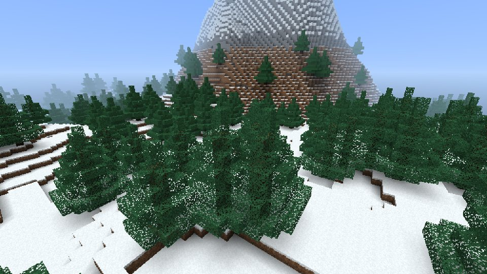 Karlı tayga ve dağlar</td>
    <td width="50%">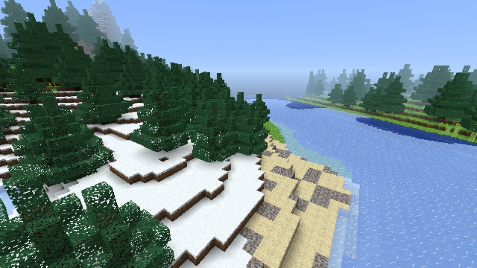 Kıvrılan nehirler ve kumsallar</td>
  </tr>
  <tr>
    <td>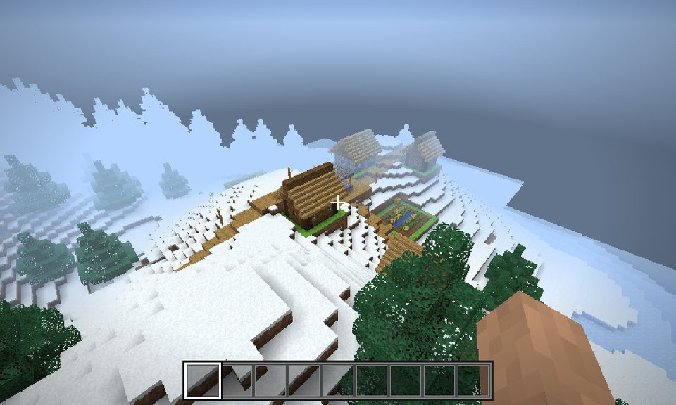 Karlı bir köy</td>
    <td>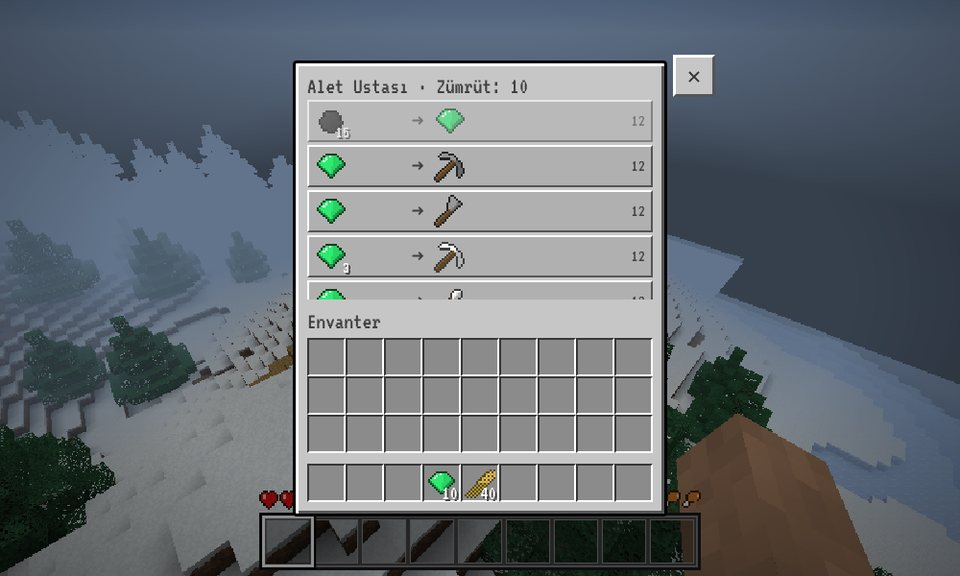 Köylüyle zümrüt ticareti</td>
  </tr>
  <tr>
    <td>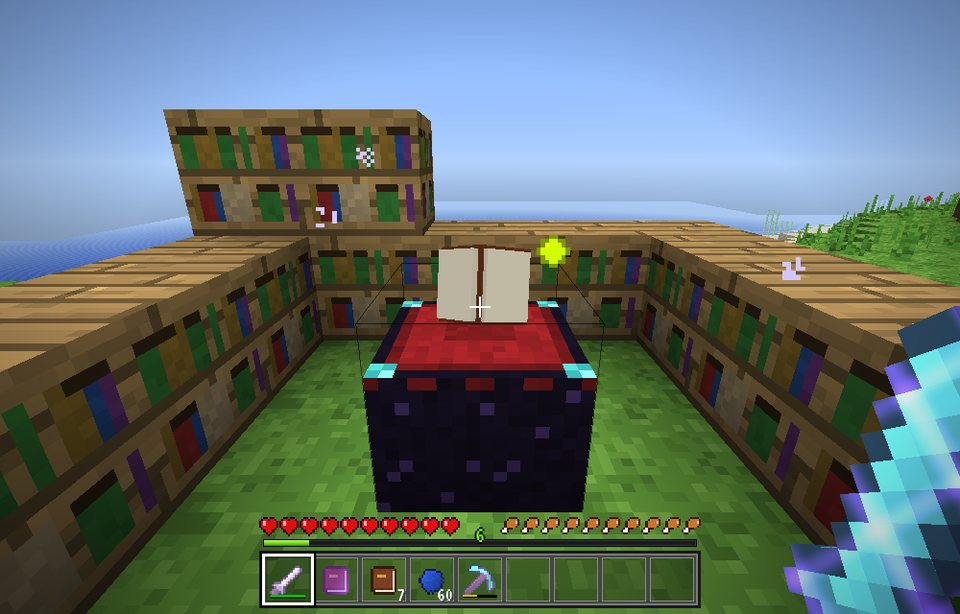 Kitaplıklarla çevrili büyü masası</td>
    <td>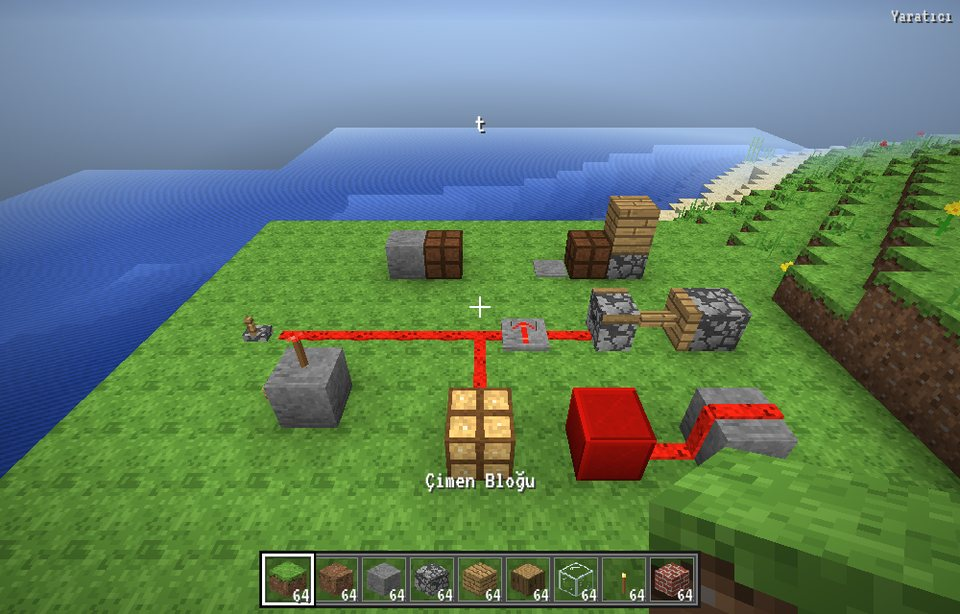 Şimşektaş devresi: şalter, tozlar, lamba ve piston</td>
  </tr>
  <tr>
    <td>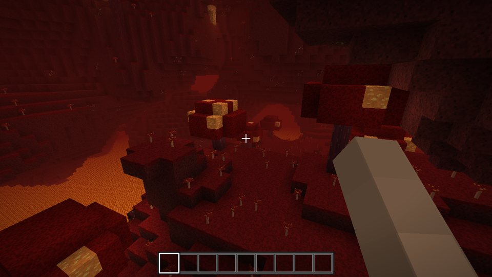 Cehennem'in kızıl ormanları</td>
    <td>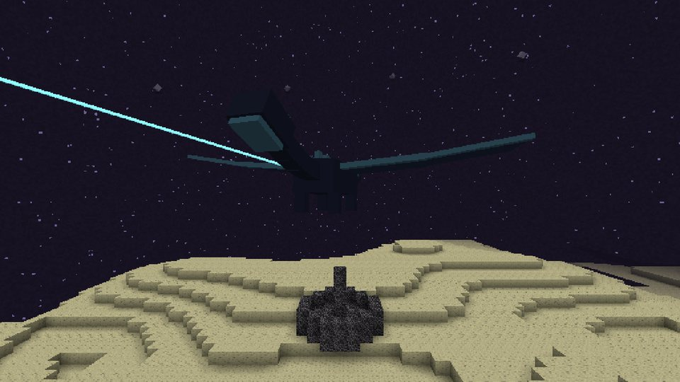 Boşluk Diyarı'nda Boşluk Ejderhası</td>
  </tr>
  <tr>
    <td>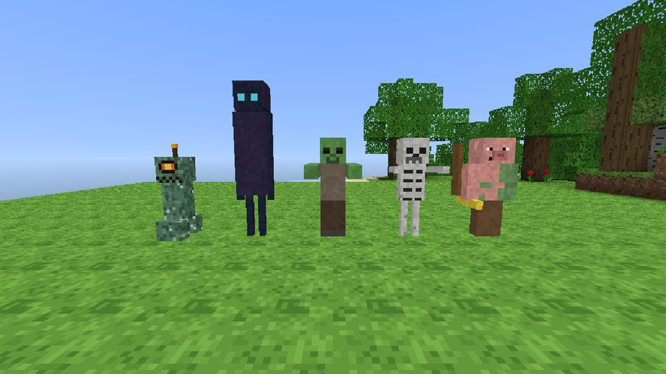 Fitil, Gölgeci, zombi, iskelet ve zombi domuzadam</td>
    <td>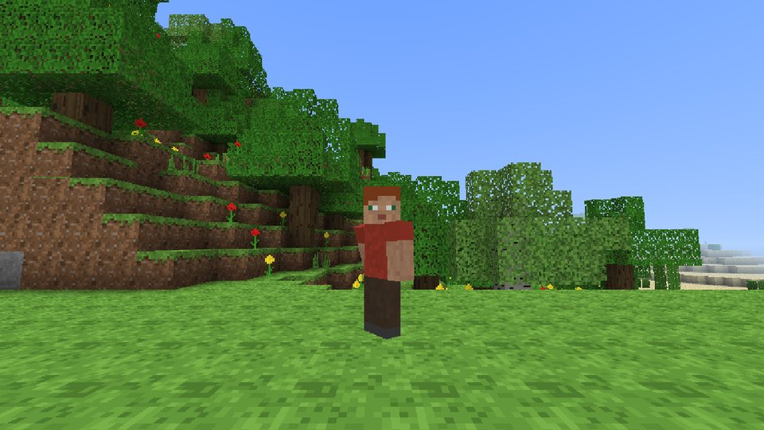 Üçüncü şahıs kamerada oyuncu (F5)</td>
  </tr>
</table>

## 🎮 Nasıl oynanır

**En kolayı:** [cagannbl.github.io/Webcraft](https://cagannbl.github.io/Webcraft/) adresini aç ve oyna. Bilgisayarda ve telefonda çalışır.

Çevrimdışı oynamak istersen:

1. Depoyu indir: **Code → Download ZIP** (ya da `git clone`).
2. Klasördeki `index.html` dosyasına çift tıkla. Chrome, Edge, Firefox ve Safari'de çalışır.
3. **Tek Oyuncu → Yeni Dünya Oluştur** ile dünyanı kur. Dünyalar tarayıcına otomatik kaydedilir.

İstersen yerel sunucuyla da açabilirsin: `python3 -m http.server`, ardından `http://localhost:8000`.

> **İlk adımlar:** Ağaç kır → kalas yap → çalışma masası kur → tahta kazma ile taşa geç. Geceleri canavarlar çıkar;
> ilk gece için bir barınak ya da yatak hazırla!

## ✨ Özellikler

<b>🌍 Dünya ve arazi</b>

- Sonsuz, tohum tabanlı prosedürel dünya: ova, orman, tayga, çöl, karlı tundra, dağlar, nehir, sahil ve okyanus biyomları
- Mağaralar, yer altı lav gölleri, kömür / demir / altın / şimşektaş / elmas / zümrüt cevherleri
- Meşe, huş ve ladin ağaçları, kaktüsler, çiçekler, uzun çimen, balkabakları
- **Arazi (yeni dünyalar)**: bükülmüş gürültüyle doğal kıyılar, kıtalar ve okyanuslar, sırt şeklinde sarp ve karlı
  dağlar, yumuşak eğimli vadilerde kıvrılan nehirler (soğukta donar), tayga (ladin ormanı) ve sıcaklık kuşaklarına
  göre yumuşak biyom geçişleri. Eski dünyalar bozulmasın diye kendi arazileriyle devam eder
- **Akan su ve lav**: kaynak/akan/düşen sıvı, en yakın çukura yönelen akış, sonsuz su kaynağı, akıntının itmesi,
  su + lav = obsidyen / kırıktaş / taş
- Güneş ışığı + blok ışığı (meşale, ışıktaşı, lav, fener balkabağı) yayılımı, yumuşak aydınlatma ve ambient occlusion
- Gece-gündüz döngüsü, kare güneş ve ay, yıldızlar, gün batımı, hareketli bulutlar, sis, animasyonlu su ve lav
- Şeker kamışı, kağıt ve kitap; kitaplıklar kırılınca kitap düşürür
- Ateşlenebilir TNT ve zincirleme patlamalar, düşen kum/çakıl

<b>🔥 Cehennem, Boşluk Diyarı ve Boşluk Ejderhası</b>

- **Cehennem**: kızıl ve çarpık ormanlar, ruh kumu vadileri, lav denizi, ışıktaşı, kuvars, kadim kalıntı (korçelik)
- **Boşluk Diyarı**: Boşluk adası, obsidyen sütunlar, çıkış geçidi, ejderha yumurtası, yankı bitkili dış adalar
- **Boşluk Ejderhası**: uçan, dalış yapan, çıkış geçidine konan boss; sütunlardaki Boşluk kristalleri onu iyileştirir,
  yenilince çıkış geçidi açılır ve ejderha yumurtası belirir
- Obsidyen çerçeve + çakmak ile Cehennem geçidi; 12 gözlü çerçeve ile Boşluk geçidi

<b>⚔️ Hayatta kalma ve yaratıcı mod</b>

- **Hayatta Kalma** modu: sağlık, düşme hasarı, boğulma, lav, kırma süresi, envanter ve tarifler (üretim)
- **Yaratıcı** mod: sınırsız blok, anında kırma, uçma (Boşluk tuşuna iki kez bas)
- **Açlık barı**: yemek, doygunluk ve yorgunluk (koşmak, zıplamak, savaşmak); tokken can yenilenir, açken can azalır
- **Tarım**: çapa ile tarla, tohum, 8 evreli buğday, suya yakın ıslak tarla, ekmek, kemik tozu, fidan dikip ağaç büyütme
- **Zırh**: deri, altın, demir, elmas ve korçelik miğfer/göğüslük/pantolon/botlar (koruma formülü, dayanıklılık)
- **Yatak**: gece uyuyup sabaha geç, doğma noktası ayarla (Cehennem'de ve Boşluk Diyarı'nda patlar)
- **Yay ve ok**: gerdikçe güçlenen atış, yerdeki okları geri toplama
- Tahta, taş, demir, altın, elmas ve netherit kazma/balta/kürek/kılıç (dayanıklılık, kazma hızı, hasar)
- Kovalar (su + lav = obsidyen), ender incisi, yiyecekler, canlı ganimetleri
- Klasik blok oyunu envanteri: 2x2 üretim, çalışma masasında 3x3 üretim, tarif kitabı, fırın, sandık, sekmeli yaratıcı envanter
- Dünyalar tarayıcıya otomatik kaydedilir (birden fazla dünya)

<b>🐑 Canlılar, köyler, tecrübe ve büyüler</b>

- Canlılar: domuz, inek, koyun, tavuk, zombi ve ok atan iskelet (gün ışığında yanarlar), duvara tırmanan örümcek,
  patlayan Fitil, ışınlanan Gölgeci ve zombi domuzadam
- **Köyler**: ova (meşe), karlı (ladin) ve çöl (kumtaşı) köyleri; yollar, kuyu, eğimli çatılı evler, demirci (ganimet
  sandığı), kütüphane, buğday tarlaları, saman balyaları, sokak lambaları
- **Köylüler ve ticaret**: 8 meslek (çiftçi, çoban, okçu, kasap, rahip, kütüphaneci, zırhçı, alet ustası), zümrütle
  ticaret, günlük yenilenen stok; köylüler gündüz köyde dolaşır, gece evlerine döner
- **Tecrübe (XP)**: canavarlardan, hayvanlardan, cevherlerden, fırından, ticaretten ve Boşluk Ejderhası'ndan tecrübe
  küreleri; seviye formülü, ölünce tecrübe yere saçılır
- **Büyüler**: büyü masası (kitaplık sayısına göre 3 seçenek, lapis + seviye bedeli, süzülen kitap ve uçan rünler),
  örs (onarım, büyü birleştirme, büyülü kitap, yeniden adlandırma, "Çok Pahalı!" sınırı, hasar gören örs);
  Koruma, Tüy Gibi Düşüş, Keskinlik, Kutsal Darbe, Geri Tepme, Alev, Ganimet, Verimlilik, İpeksi Dokunuş, Servet,
  Güç, Alev Oku, Sonsuzluk, Kırılmazlık ve Onarım; büyülü eşyalarda mor parıltı; kütüphaneciden büyülü kitap

<b>⚡ Şimşektaş devreleri ve şekilli bloklar</b>

- **Şimşektaş**: toz (güç 15'ten blok blok azalır, basamak çıkıp iner), şimşektaş meşalesi (ters çevirici), şalter,
  taş düğme, basınç plakası, şimşektaş lambası, yineleyici (1-4 tik gecikme), piston (12 bloğa kadar iter, 6 yön);
  kapılar, tuzak kapılar, çit kapıları ve TNT güçle çalışır. Güçlü/zayıf güç kuralları sade tutuldu
- **Şekilli bloklar**: yarım bloklar (birleşince tam blok), basamaklar, açılır kapı, tuzak kapı, çit ve çit kapısı,
  cam panel, tırmanma merdiveni; alçak bloklara kendiliğinden çıkma

<b>🎨 Grafik, ses ve telefon desteği</b>

- 185 blok türü (durumlar dahil) + 100'den fazla eşya, kodla üretilmiş keskin piksel-art dokular
- **Piksel grafik**: sınırlı paletli kümelenmiş piksel dokular; dokulu moblar (yüzleri, desenleri), oyuncuya
  bakan başlar, örümcek bacak ve tavuk kanat animasyonları, ot yiyen koyunlar
- **Elde tutulan eşya**: 3D kabartma eşyalar, blok, çıplak kol; sallama, yeme, yay germe,
  eşya değiştirme ve kamera ataleti animasyonları
- **Yere düşen eşyalar**: dönen/zıplayan ganimetler, toplama, birleşme, Q ile atma; **F5** ile üçüncü şahıs kamera
- **Gerçek ses efektleri**: Minetest Game, VoxeLibre ve Kenney'den açık lisanslı kayıtlar (adım, kazma, kırma, koyma,
  hayvanlar, canavarlar, kapı, sandık, TNT, yay, büyü); her çalışta rastgele varyasyon ve perde. Kaydı olmayan sesler
  sentezlenir; müzik üretken piyano. Emeği geçenler ve lisanslar: [`sounds/CREDITS.md`](sounds/CREDITS.md).
  Sesler `js/sounds-data.js` içine gömülüdür; oyun dosyaya çift tıklanarak açıldığında da çalar. Ses ekleyip
  çıkardıktan sonra `python3 tools/build_sounds_data.py` ile yeniden üret.
- **Telefon desteği** (Chrome): mobil oyunlardaki gibi dokunmatik kontroller (dokun = koy, basılı tut = kır,
  yüzen joystick), envanterde hızlı aktarma / tek tek modları, eşya çubuğunda basılı tutarak atma, tam ekran +
  yatay kilit, ekrana göre küçülen envanter, FPS'e göre otomatik çözünürlük

## ⌨️ Kontroller

| Tuş | İşlev |
| --- | --- |
| W A S D | Hareket |
| Boşluk | Zıpla / yüz (Yaratıcı'da iki kez: uç) |
| Shift | Eğil / alçal |
| R, Ctrl veya W W | Koş |
| Sol tık | Kır / saldır |
| Sağ tık | Koy / kullan / masa, fırın, sandık, yatak, büyü masası, örs |
| Sağ tık (basılı) | Yemek ye / yayı ger |
| Orta tık | Bloğu seç |
| 1-9, tekerlek | Eşya seç |
| E | Envanter ve tarifler |
| F1 / F2 / F3 | Arayüzü gizle / ekran görüntüsü / hata ayıklama |
| F5 | Üçüncü şahıs kamera |
| Q / Ctrl+Q | Eşya at / yığını at |
| Esc | Duraklat |

Telefonda: sol alttaki joystick ile yürü, ekrana dokunarak blok koy, basılı tutarak kır, sürükleyerek etrafa bak.

## 🛠️ Kod yapısı

| Dosya | İçerik |
| --- | --- |
| `js/util.js` | Gürültü (simplex), rastgele sayı, matris yardımcıları |
| `js/blocks.js` | Blok tanımları, prosedürel dokular, ikonlar |
| `js/items.js` | Eşyalar, aletler, tarifler, fırın tarifleri, kazma kuralları |
| `js/shapes.js` | Yarım blok, basamak, kapı, çit vb. kutu modelleri (çizim + çarpışma) |
| `js/fluids.js` | Su ve lav akış simülasyonu |
| `js/redstone.js` | Şimşektaş devreleri: güç hesabı, toz ağları, meşale, yineleyici, lamba, kapı, piston |
| `js/dragon.js` | Boşluk Ejderhası ve Boşluk kristalleri |
| `js/villages.js` | Köy üretimi, köylüler, ticaret, sandık ganimeti |
| `js/enchant.js` | Tecrübe formülleri, büyüler, büyü masası ve örs hesapları |
| `js/world.js` | Parçalar, arazi/biyom/mağara/ağaç üretimi |
| `js/mesher.js` | Işık yayılımı ve mesh üretimi |
| `js/renderer.js` | WebGL2 çizici ve shader'lar |
| `js/player.js` | Fizik, çarpışma, ışın izleme, oyuncu |
| `js/entities.js` | Canlılar, yapay zekâ, parçacıklar |
| `js/audio.js` | Ses kayıtlarını yükleme/çalma, sentez yedekleri ve müzik |
| `sounds/` | Ses kayıtları (OGG) ve `CREDITS.md` |
| `js/sounds-data.js` | Sayfaya gömülü ses verisi (otomatik üretilir) |
| `js/ui.js` | Menüler, HUD, envanter, dokunmatik kontroller |
| `js/main.js` | Oyun döngüsü, etkileşim, kayıt |

## 📜 Lisans

Kod, kodla üretilen dokular/modeller ve belgeler [MIT lisansı](LICENSE) ile paylaşılır.
Ses kayıtları bu lisansa dahil değildir: Minetest Game, VoxeLibre ve Kenney projelerinden alınan her kayıt kendi
lisansını (CC0, CC BY, CC BY-SA veya MIT) korur. Yazarlar ve lisanslar [`sounds/CREDITS.md`](sounds/CREDITS.md)
dosyasında listelenir.

---

*WebCraft, Minecraft'tan esinlenmiş bağımsız bir hayran projesidir. Mojang Studios veya Microsoft ile bağlantısı yoktur.*

